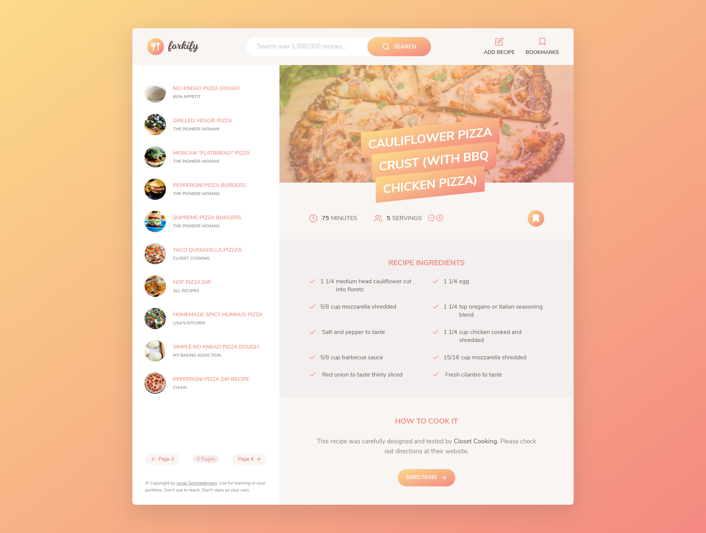
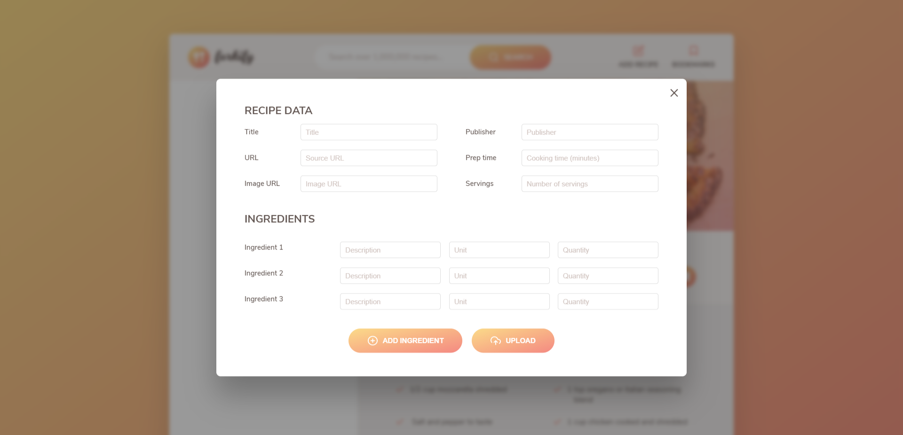

# Forkify App


An app that helps you find delicious recipes for your next meal.

### App Home Page



### App Recipe Upload Form



## How to run app locally?

You need to take following steps to be able to run app locally:

1. Download the zip file from repo.
2. Extract the zipped file using WinRAR, or 7-Zip.
3. If you don't have Node installed, install Node [here](https://nodejs.org/en/).
4. Locate the project folder in your Terminal/Command Line.
5. Run the following commands one after another:

   ```bash
   npm install
   ```

   Above command will install all packages and project dependencies, then run following command:

   ```bash
   npm run build
   ```

   This command will bundle all the project files into dist folder in minified format. If you dont want the minified code, run `npm run buildNoMinify` instead of `npm run build`.

6. Run `index.html` file from dist folder, and you are done, yay!
